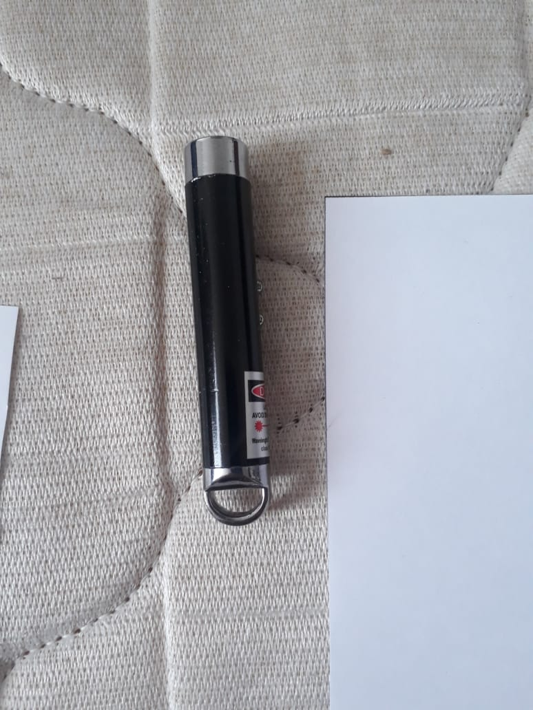
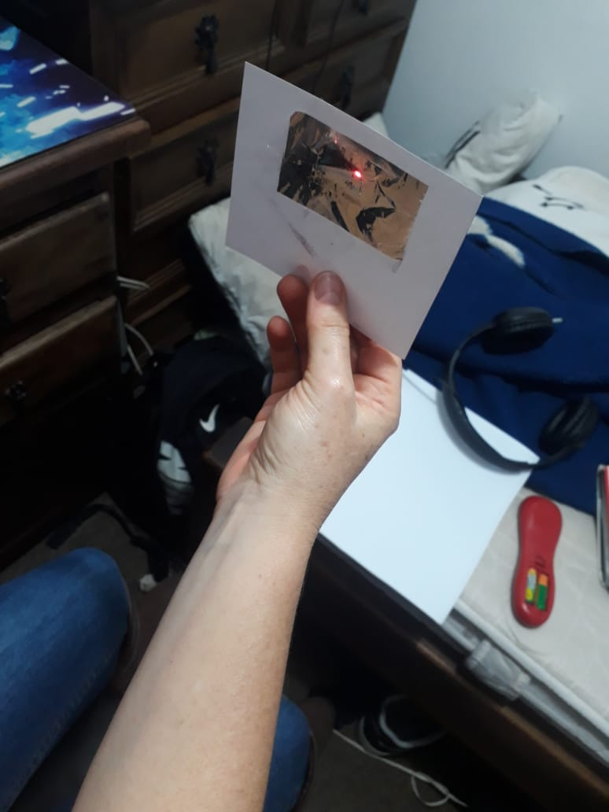
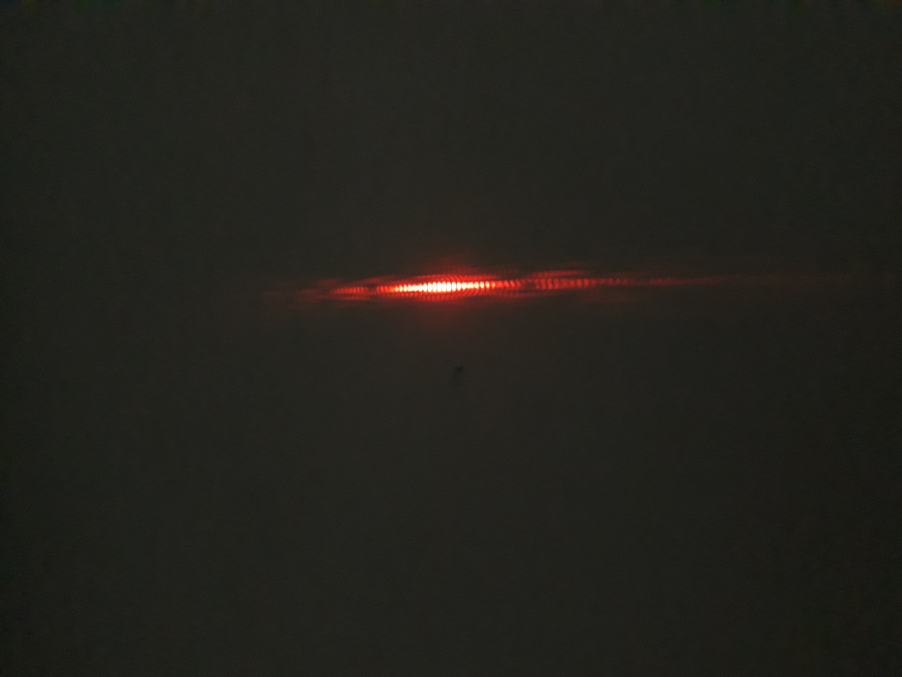
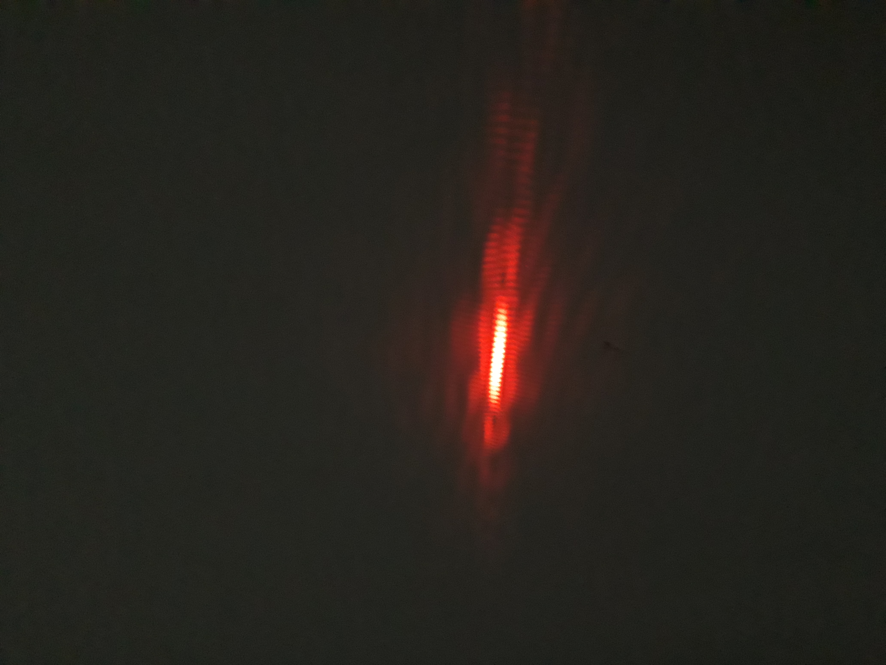
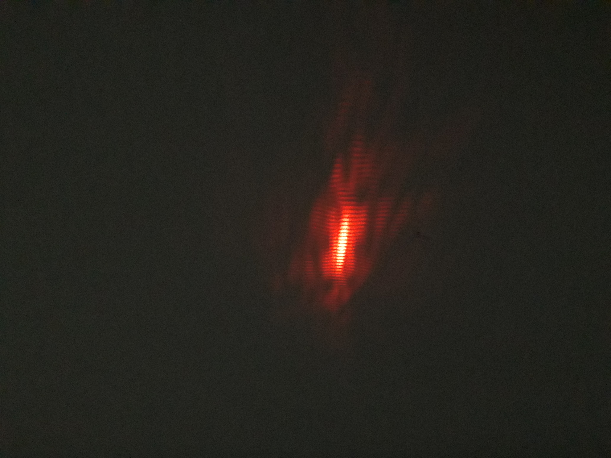
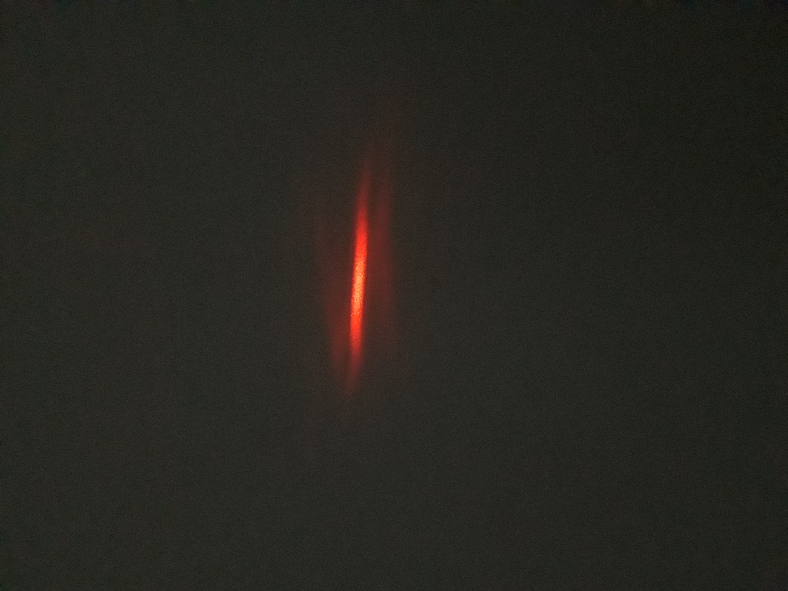
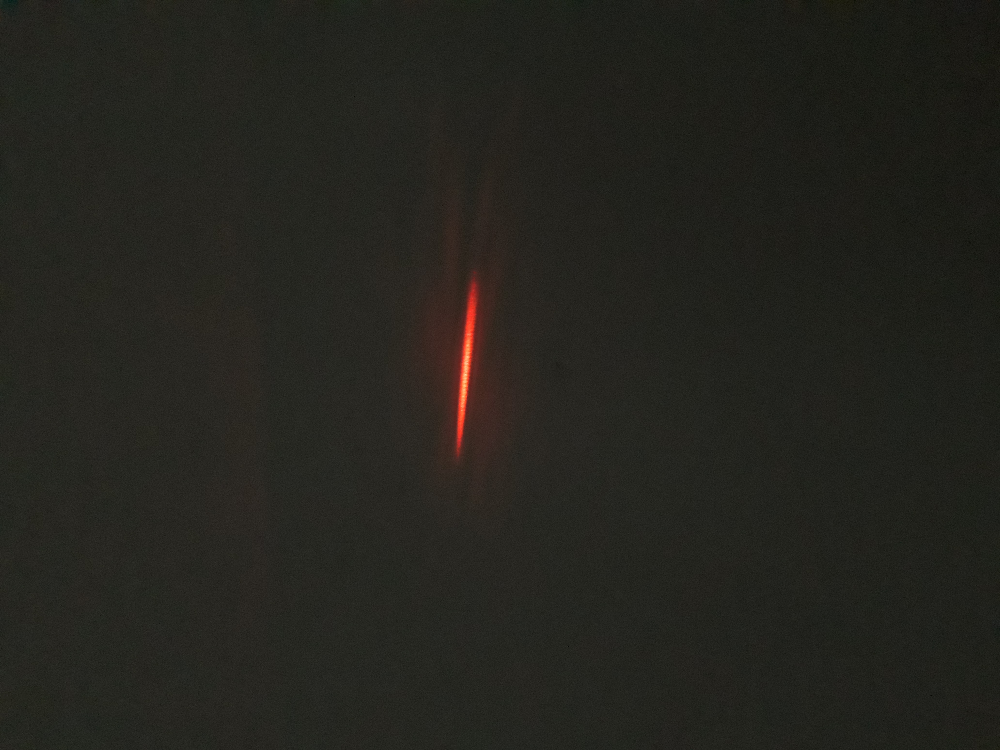
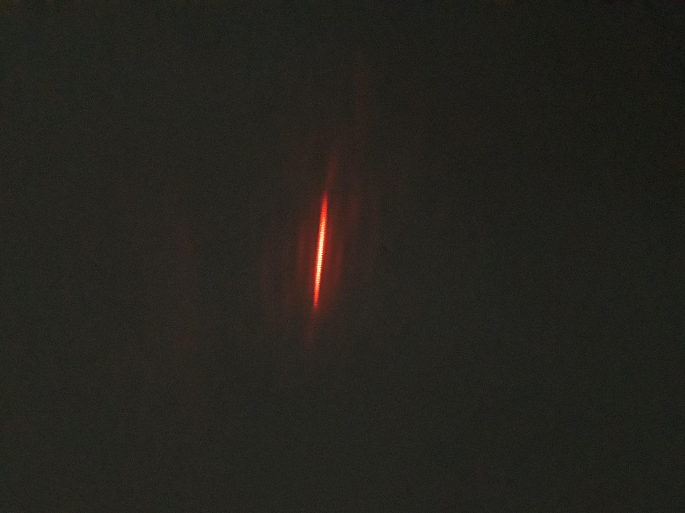
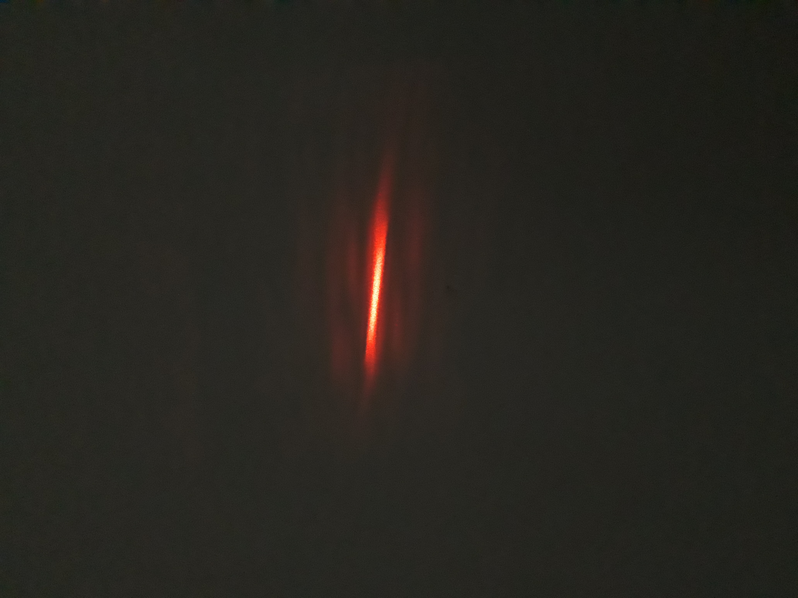

Realizado por Juan Felipe Mora Quintero

# NumerosComplejos

En esta librería encontraran distintas operaciones con números complejos y a su vez la interacción de estos en distintos ambientes como lo son matrices y vectores y como las operaciones básicas de los números complejos actúan en estos ambientes.

# Realización de las pruebas

Para la facilidad de la realización de las pruebas se hicieron varios archivos de prueba en los cuales cada uno tiene un nombre en el cual hace referencia cual cual código ara las pruebas, para realizaras se abrirá la carpeta de pruebas  dentro de ella abra solo una carpeta la cual abriremos y encontraremos las distintas pruebas

# Explicación de las pruebas

En este espacio se detallaran cada una de las pruebas que comprenden cada uno de los ejercicios realizados.

 1. **Suma de complejos**
	  En este prueba se muestra como el codigo acepta dos numeros complejos y saca el resultado de la suma de estos dos.
    
	

 2. **Resta de complejos**
	  En este prueba se muestra como el código acepta dos números complejos y saca el resultado de la resta de 					estos dos.
	  
	 
	
 3.  **Multiplicación de complejos**
	En este prueba se muestra como el código acepta dos números complejos y saca el resultado de la multiplicación de estos dos.
	
 
	
	
# **Experimentos**

# **1.	Experimento de la doble rendija**

**Descripcion:**

**Realización:**

**a. Materiales**

	- Una hoja de papel
	- Un bisturi
	- Una hoja de papel aluminio
	- Un lacer
	- Un marcador negro

**b. Pasos**

1. Para iniciar con el experimento marcaremos en la hoja blanca en uno de sus bordes centrales una raya gruesa con el marcador negro.
	
2. Con el bisturi realizar dos cortes dentro de esta linea, estos dos cortes tienen que estar muy cercanos.
	
3. Con el lacer vamos a apuntarle a esta rendija que creamos en el papel y procedemos a observar en la pared o en el objeto que tengamos al frente, el patron que logramos obtener.
	
**Segunda forma**
	
1. Para iniciar con el experimento vamos a cortar una hoja de papel de forma que se forme un marco donde proximamente estara nuestro papel aluminio.
	
2. Ponemos una hoja de papel aluminio en el marco que hemos creado y lo aseguramos a la hoja con cinta.
	
3. Con el bisturi realizamos dos cortes en linea recta en la hoja de aluminio. El los dos cortes deben ser muy sercanos.
	
4. (Para este paso vamos a tener precaucion por que la hoja de aluminio generara un reflejo del lacer que puede apuntar a los ojos).
	
Con el lacer vamos a apuntar hacia la rendija que construimos en el papel alimunio y observaremos en la pared o en el objeto que se tenga al frente el patron que se formara.
	
	

**Fotos de demostración:**

**Proceso con papel aluminio:**

 

 

 

 

 

**Proceso con papel:**

 
 

