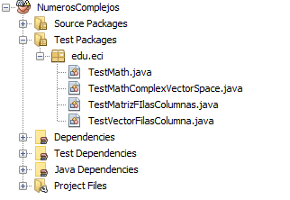

Realizado por Juan Felipe Mora Quintero

# NumerosComplejos

En esta librería encontraran distintas operaciones con números complejos y a su vez la interacción de estos en distintos ambientes como lo son matrices y vectores y como las operaciones básicas de los números complejos actúan en estos ambientes.

# Realización de las pruebas

Para la facilidad de la realización de las pruebas se hicieron varios archivos de prueba en los cuales cada uno tiene un nombre en el cual hace referencia cual cual código ara las pruebas, para realizaras se abrirá la carpeta de pruebas  dentro de ella abra solo una carpeta la cual abriremos y encontraremos las distintas pruebas

# Explicación de las pruebas

En este espacio se detallaran cada una de las pruebas que comprenden cada uno de los ejercicios realizados.

 1. **Suma de complejos**
	  En este prueba se muestra como el codigo acepta dos numeros complejos y saca el resultado de la suma de estos dos.
    
	

 2. **Resta de complejos**
	  En este prueba se muestra como el código acepta dos números complejos y saca el resultado de la resta de 					estos dos.
	  
	 
	
 3.  **Multiplicación de complejos**
	En este prueba se muestra como el código acepta dos números complejos y saca el resultado de la multiplicación de estos dos.
	
	 
	
	
# **Experimentos**

# **1.	Experimento de la doble rendija**

**Descripcion:**

**Realización:**

**a. Materiales:**

**b. Pasos:**

**Fotos de demostración:**

 

 

 

 

 

 

